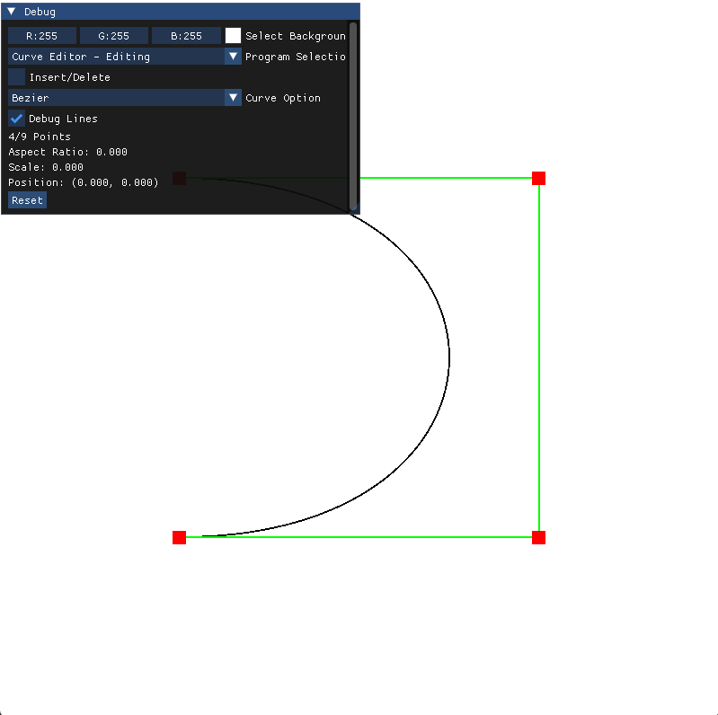

## Bezier and B-Spline curve viewer and editor

Create bezier or b-spline curves that can be viewed in 3D space. Surface of revolution can be created based off of curves created. View tensor product surface.

